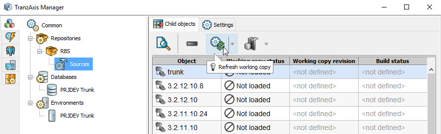
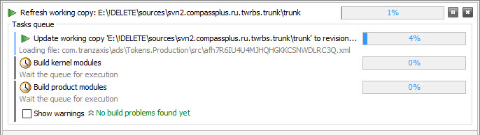

Начало работы с приложением TranzAxis Manager
----------
> В качестве примера будут рассмотрены настройки, необходимые для запуска TranzAxis и подключения его к средам разработки:
> 
> * Среда проектных разработчиков (PRJDEV Trunk).
> * Среда разработчиков TranzAxis (RBS)

1. [Настройка рабочего каталога](#workdir)
1. [Добавление и загрузка репозитория SVN](#repository)
1. [Добавление ссылки на базу данных](#database)
1. [Создание окружения запуска TranzAxis](#environment)
    1. [Окружение проектных разработчиков](#environment-prjdev)
    1. [Окружение разработчиков TranzAxis](#environment-rbs)
1. [Запуск TranzAxis](#run)

## Настройка рабочего каталога 
Если вы в первые запускаете приложение в первую очередь нужно указать рабочий каталог приложения. Пока это не сделано, все последующие шаги настройки невозможны, поскольку соответствующие узлы дерева конфигурации заблокированы:

> &#9873; Этот каталог будет использоваться для хранения загружаемых из SVN файлов:
> 
> * Исходных кодов продукта для последующей сборки
> * Бинарных файлов релиза продукта
> 
> Если ваш компьютер оснащен SSD диском, имеет смысл разместить каталог на нем, т.к. TranzAxis (как и любой другой продукт на базе платформы RadixWare) представляет собой набор большого количества файлов JAR и при размещении их на SSD запуск происходит быстрее. Особенно это актуально если вы в будущем планируете компилировать TranzAxis из исходных кодов. 

## Добавление и загрузка репозитория SVN 
И исходники продукта и его релизы (скомпилированные версии продукта) размещаются в SVN. Для того чтобы получить к ним доступ нужно завести объект "Репозиторий". В обоих случаях мы будем использовать репозиторий разработки TranzAxis.
Для этого в каталоге Repositories создаем новый объект:

* **Title**: любое (например, “RBS")
* **SVN url**: "svn+cplus://svn2.compassplus.ru/twrbs/trunk"
* **Authentication mode**: без аутентификации (предполагается в ОС настроен туннель, как описано в базе знаний IT)

Сохраняем настройки и запускаем команду загрузки структуры репозитория:

В процессе загрузки приложение просматривает дочерние каталоги в указанном пути SVN и загружает те из них, которые необходимы для работы:

* **/dev** - Содержит ветви разработки TranxAxis. При загрузке создается дочерний узел Sources, в котором отображаются все версии. Если вы будете скачивать исходные коды TranzAxis - это выполняется здесь (но об этом немного позже).
* **/releases** - Содержит релизы TranzAxis. При загрузке объекты помещаются в память, а в дерево не добавляются поскольку не содержат никаких настроек и операций.

### Добавление ссылки на базу данных 
Поскольку все данные создаваемые самим программным продуктом TranzAxis и пользователями хранятся в базе данных, для его запуска нам нужно указать адрес БД и параметры подключения к ней.

База данных продуктовых и проектных разработчиков TranzAxis размещена на сервере **TERMINAL-PAB** по адресу **10.7.1.55**, порт слушателя запросов - стандартный для Oracle - **1521**. Различаются только имена схем, а значит для каждой схемы потребуется свой собственный объект в каталоге Databases. Поскольку принципиальных различий нет, приведу оба варианта настроек в таблице:

| Схема базы данных             | Настройки объекта Database      |
| ----------------------------- | ------------------------------- |
| *Схема проектных разработчиков* | **Title**: любое (например, "PRJDEV Trunk")  **Database URI**: "10.7.1.55:1521/TX" **Schema name**: "PRJDEV_TRUNK"   **Schema password**: "PRJDEV_TRUNK"|
| *Схема разработчиков TranzAxis* | **Title**: любое (например, "RBS")  **Database URI**: "10.7.1.55:1521/TX" **Schema name**: "RBS"   **Schema password**: "RBS"|

## Создание окружения запуска TranzAxis 
Объект "Окружение" объединяет в себе настройки запуска приложения и источник бинарных файлов приложения.
Настройки для выбранных примеров уже различаются, потому имеет смысл рассмотреть их подробнее и отдельно.

### Окружение проектных разработчиков 
В каталоге Environments создаем новый объект с настройками для нашей задачи:

| Свойство          | Значение |
| ----------------- | -------- |
| **Title**         | Любое (например, "PRJDEV Trunk") |
| **Top Layer URI** | Ввести "com.tranzaxis" (или выбрать значение из БД, после указании ссылки на объект Database на следующем шаге)|
| **DB Connection** | Выбрать из списка "PRJDEV Trunk" (этот объект мы создали ранее) &#9873; *После указания свойств **Top Layer URI** и **DB Connection** в поле **Version in database** отобразится версия объектов базы данных (а если говорить точнее - версия TranzAxis которой они соответствуют).* |
|**Instance ID** |Выбрать нужное значение из уже имеющихся инстанций в данной схеме БД. Если вы еще не создавали свою инстанцию - следует использовать **1-Local**. &#9873; *Когда вы создадите свою инстанцию - нужно будет изменить значение этого поля*.|
|**Repository**|Выбрать из списка "RBS" (этот объект мы создали ранее). Именно релизы из этого репозитория мы будем использовать для запуска TranzAxis.|
|**Binaries location**|Выбрать "Release", т.к. мы пока не планируем запуск TranzAxis из скомпилированных исходных кодов.|
|**Released version**|Выбрать из списка нужную версию. &#9873; *Самая подходящая (которая соответствует значению поля Version in database) будет подсвечена зеленым цветом*.|

Теперь можно запускать TX Server, Explorer или сразу оба приложения командами сущности. 

> &#9873; Перед запуском TX запускается задача проверки кэша бинарных файлов (если какие-либо файлы отсутствуют - они будут загружены) и только потом стартует приложение.

### Окружение разработчиков TranzAxis 
Это окружение имеет некоторые особенности, а именно - структура объектов БД непрерывно изменяется вслед за ежедневными изменениями самого продукта. В связи с этим и версия запускаемого приложения также должна быть как можно более "свежей". Фактически, нам нужно использовать актуальную версию приложения, скомпилированную из исходных кодов, которые в свою очередь получены из ветви разработки **trunk**. И здесь нужно вернуться немного назад, к тому моменту где мы заводили объект Repository, поскольку прежде чем продолжить, нам потребуется скомпилированная версия TranzAxis.

В каталоге Sources ранее созданного репозитория в селекторе ветвей разработки выбрать «trunk» (всегда первая в списке) и запустить команду загрузки и компиляции рабочей копии. Опцию очистки можно не включать (эта опция нужна для удаления ранее скомпилированных файлов JAR и для первой сборки она не нужна).

Будет запущена групповая задача, включающая в себя:

* Создание рабочей копии исходных кодов TranzAxis (команды "svn checkout" в первый раз и "svn update" при повторном запуске)
* Сборку ядра TranzAxis
* Сборку модулей TranzAxis

По её завершению поля в селекторе будут обновлены:

Теперь можно настроить окружение для запуска TranzAxis:

| Свойство          | Значение |
| ----------------- | -------- |
| **Title**         | Любое (например, "RBS") |
| **Top Layer URI** | Ввести "com.tranzaxis"|
| **DB Connection** | Выбрать из списка "RBS" (этот объект мы создали ранее) |
|**Instance ID** |Выбрать нужное значение из уже имеющихся инстанций в данной схеме БД. Если вы еще не создавали свою инстанцию - следует использовать **1-Local**. &#9873; *Когда вы создадите свою инстанцию - нужно будет изменить значение этого поля*.|
|**Repository**|Выбрать из списка "RBS" (этот объект мы создали ранее). Именно рабочие копии этого репозитория мы будем использовать для запуска TranzAxis.|
|**Binaries location**|Выбрать "Development", т.к. нам потребуется скомпилированная версия продукта.|
|**Released version**|Выбрать из списка скомпилированную версию продукта (в этом примере это - "trunk").|

## Запуск TranzAxis 
Если все настроено верно, приложения TranzAxis запускаются командами окружения (в противном случае они могут быть недоступны):

