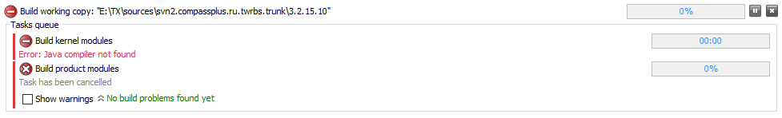
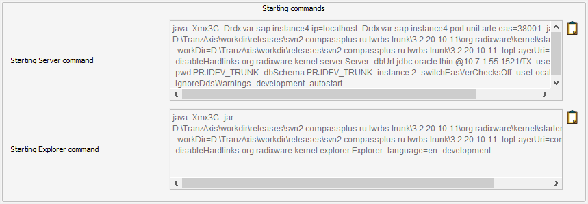
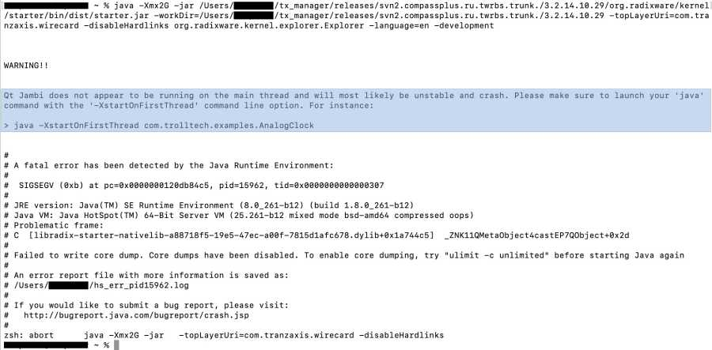
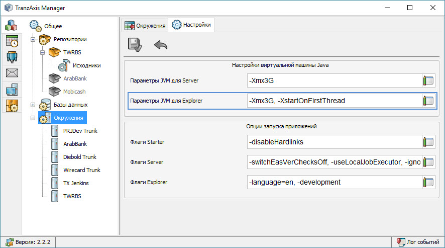

Проблемы и решения
----------

1. [Ошибка компиляции рабочей копии "Java compiler not found"](#compiler)
1. [Анализ проблем запуска RW Server / RW Explorer](#commands)
1. [Запуск RW Explorer на Mac OS](#macos_rxe)

## Настройка рабочего каталога <a name="compiler"></a>
Иногда при запуске компиляции рабочей копии при попытке сборки ядра возникает следующая ошибка:



Данная ошибка свидетельствует о том, что приложение не смогло найти компилятор Java, который необходим на данном этапе. Этому есть две возможные причины:

* На компьютере не установлен пакет JDK, в состав которого входит и компилятор.
* На компьютере помимо JDK установлен также и JRE и при запуске приложения двойным щелчком мыши запускается приложение javaw.exe из каталога JRE. 

Соответственно, для того чтобы избежать данную проблему, требуется исключить обе этих причины. Для этого нужно установить (если еще не установлен) пакет JDK и в зависимости от способа запуска приложения скорректировать команду:

* **Запуск приложения из командной строки.** В общем виде команда выглядит следующим образом
<br />
```
javaw -jar <path>/manager.jar
```
<br />
В этом случае решением будет дописать в команду запуска полный путь до приложения javaw.exe, расположенного в каталоге с установленным JDK, например:
<br />
```
"C:\Program Files\Java\jdk1.8.0_251\bin\javaw" -jar {path}/manager.jar
```
* **Запуск приложения двойным щелчком мыши.** При таком способе запуска OC Windows исполняет команду, ассоциированную с типом файла, данная команда указывается в реестре по пути **HKEY_CLASSES_ROOT\jarfile\shell\open\command** и может обновляться при установке JDK/JRE. Если значение ключа содержит путь к приложению javaw.exe в каталоге JRE это приведет к данной проблеме:
<br/>
```
"C:\Program Files\Java\jre1.8.0_251\bin\javaw.exe" -jar "%1" %*
```
<br/>
В этом случае решением будет изменить команду запуска таким образом, чтобы полный путь до приложения javaw.exe также включал в себя каталог JDK.

## Анализ проблем запуска RW Server / RW Explorer <a name="commands"></a>

> При выполнении одной из команд окружения:
> 
> * Запуск RadixWare Server
> * Запуск RadixWare Explorer
> 
> порождается отдельная задача, в которой запускается отдельный (дочерний) процесс JVM в котором и будет исполняться указанное приложение. При этом задача будет ожидать завершение данного процесса.

В случае когда при старте приложения возникают проблемы, определяемые следующими "симптомами":

* **Задача завершилась вскоре после запуска** - означает что дочерний процесс завершился с ошибкой.
* **Задача висит в мониторе, но приложение не запускается** - возможно дочерний процесс завис или не может по какой-то причине завершиться.

необходимо определить изначальную причину проблем, возникающих внутри дочернего процесса. Однако поток ввода/вывода процесса никак не перехватывается процессом TX manager, что лишает пользователя возможности проверить лог ошибок. Для того чтобы получить лог ошибок нужно запустить приложение из консоли операционной системы, при этом важно воспроизвести все условия запуска (параметры JVM, стартера и приложения). Для удобства в редакторе расширенных свойств окружение добавлено не редактируемое поле, в котором отображаются консольные команды запуска (отдельно для Server и Explorer). Данное динамически обновляется при изменении настроек окружения: 



Таким образом, используя данную команду можно быть уверенным что начальные условия запуска приложения из консоли совпадают с теми, которые задаются TX Manager при старте дочернего процесса. 

## Запуск RW Explorer на Mac OS <a name="macos_rxe"></a>
Для запуска приложения, использующего Qt для построения интерфейса (коим является RW Explorer) требуется в обязательном порядке указать флаг JVM "-XstartOnFirstThread": 

> The option causes the JVM to use thread 0 to start the application. Apparently this is necessary to get Mac OSX to run SWT and GWT apps properly. According to the Eclipse SWT FAQ, AWT and Swing apps use some undocumented magic to do this.

В противном случае приложение не запустится, а логе консоли будет выведено следующее:



Для решения проблемы данный флаг нужно добавить в поле "Параметры JVM для Explorer" в одном из следующих мест:

* **В редакторе свойств каталога окружений** - в контексте проблемы (связана с системой, а не с конкретным окружением) это место наиболее логично.
* **В редакторе расширенных свойств конкретного окружения** - предварительно перекрыв унаследованные значения. 




